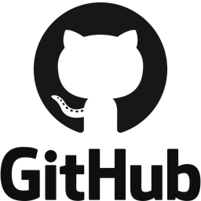
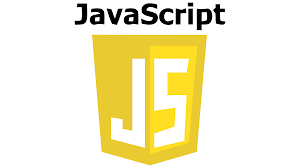

# Career Development Plan 🎓

---

## Project Description 🧾

A simple, JavaScript-driven Kanban board tailored for monitoring career growth milestones. It presents tasks in a clear visual layout across three workflow stages—🔵 TODO, 🟣 DOING, and 🟢 DONE—using interactive cards and a modal-based editing system. Built with plain JavaScript and direct DOM manipulation, it showcases essential frontend development concepts without relying on external libraries.

---

## Technologies Used 👨🏽‍💻

---

## Features 🛠️

##### ✅ Task Visualization

- Dynamically renders tasks from JavaScript array

- Auto-groups by status (todo/doing/done)

- Color-coded status indicators

##### ✅ Interactive Elements

- Click-to-edit task details in modal

- Form fields for title, description, and status updates

- Modal closes via, dedicated close button (✖)
  and backdrop click

---

## Setup Instructions 🧩

1. Open index.html in your browser to launch the preloaded Kanban board with 6 example tasks organized into TODO, DOING, and DONE columns.

2. Click any task card to open its editing modal featuring interactive form fields for title, description, and status (selectable via dropdown).

3. Modify task details directly in the modal's input fields, changes cannot be saved yet so that they can appear on the task cards.

4. Close the modal by clicking the red ❌ button (top-right) or anywhere outside the modal window.

5. The responsive design works seamlessly across mobile and desktop browsers without requiring console interactions.

---

## Usage Instructions 🪄

1. Edit any task by clicking its card to open the modal, where you can update the title, description, and status via dropdown menu.

2. Track progress visually by moving tasks between the TODO, DOING, and DONE columns through status changes in the modal.

3. Close the editor instantly by clicking the red ✖ button or anywhere outside the modal window.

4. Watch your career progress as completed tasks accumulate in the DONE column with persistent visual feedback.
